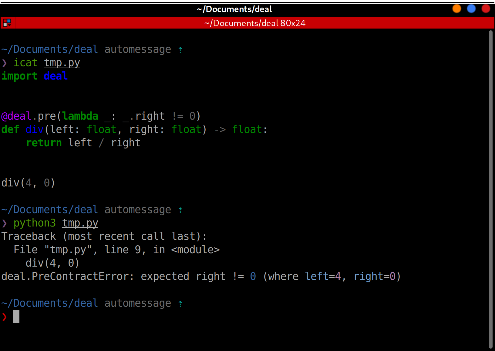

# Runtime

Call the functions, do usual tests, just play around with the application, deploy it to staging, and Deal will check contracts in runtime. On contract violation, deal raises an exception. In general, you shouldn't ever catch these exceptions because contracts must be never violated. Contract violation means a bug.



## Contracts on production

If you run Python with `-O` option, all contracts will be disabled. This is uses Python's `__debug__` variable:

> The built-in variable `__debug__` is True under normal circumstances, False when optimization is requested (command line option -O).
> Source: [Python documentation](https://docs.python.org/3/reference/simple_stmts.html#assert)

Also, you can explicitly enable or disable contracts:

```python
# disable all contracts
deal.disable()

# enable all contracts
deal.enable()

# restore the default behavior
# (enabled if `__debug__` is True, disabled otherwise)
deal.reset()
```

## Permamently disable contracts

When contracts are disabled, functions are still get wrapped in case you want to enable contracts again, after all functions already initialized. That means, even if you disable contracts, there is still a small overhead in runtime that might be critical in for some applications. To avoid it and tell deal to disable contracts permanently, call `deal.disable(permament=True)`. There is what you should know:

1. If you permamently disable the contracts, you cannot enable them anymore. Trying to do so will raise `RuntimeError`.
1. This flag is checked only when functions are decorated, so you need to call it before importing any decorated functions.
1. Functions that were decorated before you permamently disabled contracts will behave in the same way as if you just called `deal.disable()`, with a quick check of the state in runtime on each call.

## Colors

If no error message or custom exception specified for a contract, deal will show contract source code and passed parameters as the exception message. By default, deal highlights syntax for this source code. If your terminal doesn't support colors (which is possible on CI), you can specify `NO_COLOR` environment variable to disable syntax highlighting:

```bash
export NO_COLOR=1
```

See [no-color.org](https://no-color.org/) for more details.
