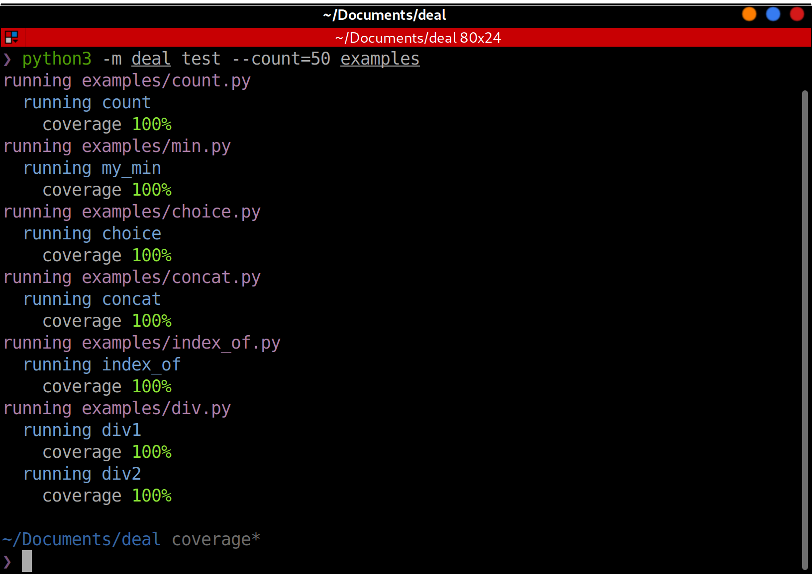

# Tests

Deal can automatically test your functions. First of all, your function has to be prepared:

1. All function arguments are type-annotated.
1. All exceptions that function can raise are specified in [@deal.raises](side-effects).
1. All pre-conditions are specified with [@deal.pre](values).

Then use `deal.cases` to get test cases for the function. Every case is a callable object that gets no arguments. Calling it will call the original function with suppressing allowed exceptions.

## Example

```python
@deal.raises(ZeroDivisionError)
@deal.pre(lambda a, b: a >= 0 and b >= 0)
def div(a: int, b: int) -> float:
    return a / b


for case in deal.cases(div):
    case()
```

## CLI

There is a CLI command named `test`. It extracts `@deal.has()` (without arguments) wrapped functions and runs `deal.cases` powered tests for it.

```bash
python3 -m deal test project/*.py
```

The command is helpful when you don't have tests for some pure functions yet but want to get an early feedback.

For every ran function, deal calculates and shows coverage. This is a helpful indication on how good deal was at finding the correct input values.



## PyTest

A simple snippet to use `deal.cases` with [pytest](https://docs.pytest.org/en/latest/) (type annotations for the test function are optional):

```python
@pytest.mark.parametrize('case', deal.cases(div))
def test_div(case: deal.TestCase) -> None:
    case()
```

## How it works

1. Deal generates random values for all function arguments with [hypothesis](https://hypothesis.readthedocs.io/en/latest/).
1. For every arguments combination `deal.cases` returns `deal.TestCase` object.
1. `deal.TestCase` on calling is doing the next steps:
    1. Calling the original function with all decorators and contracts.
    1. Suppressing exceptions from `deal.pre` and `deal.raises`. In that case, `typing.NoReturn` returned.
    1. Validating type of the function result if it's annotated.
    1. Returning the function result.

All uncatched exceptions are raised: everything you forgot to specify in `@deal.raises`, `deal.PostContractError`, `deal.OfflineContractError` etc.

## Configuring

Specify samples count (50 by default):

```python
deal.cases(div, count=20)
```

Explicitly specify arguments to pass into the function:

```python
deal.cases(div, kwargs=dict(b=3))
```

## deal.TestCase

`deal.TestCase` object has the next attributes:

+ `case.args` -- tuple of positional arguments that will be passed into the original function.
+ `case.kwargs` -- dict of keyword arguments that will be passed into the original function.
+ `case.func` -- the original function itself
+ `case.exceptions` -- tuple of all exceptions that will be ignored.

When called, `case` calls `case.func` and returns the call result. If an exception from `case.exceptions` was raised, `typing.NoReturn` returned.

## Practical example

The best case for Contract-Driven Development is when you have a clear business requirements for part of code. Write these requirements as contracts, and then write a code that satisfy these requirements.

In this example, we will implement `index_of` function that returns index of the given element in the given list. Let's think about requirements:

1. Function accepts list of elements (let's talk about list of integers), one element, and returns index.
1. Result is in range from zero to the length of the list.
1. Element by given index (result) is equal to the given element.
1. If there are more than one matching element in the list, we'll return the first one.
1. If there is no matching elements, we'll raise `LookupError`.

And now, let's convert it from words into the code:

```python
from typing import List, NoReturn
import deal

# if you have more than 2-3 contracts,
# consider moving them from decorators into separate variable
# like this:
contract_for_index_of = deal.chain(
    # result is an index of items
    deal.post(lambda result: result >= 0),
    deal.ensure(lambda items, item, result: result < len(items)),
    # element at this position matches item
    deal.ensure(
        lambda items, item, result: items[result] == item,
        message='invalid match',
    ),
    # element at this position is the first match
    deal.ensure(
        lambda items, item, result: not any(el == item for el in items[:result]),
        message='not the first match',
    ),
    # LookupError will be raised if no elements found
    deal.raises(LookupError),
    deal.reason(LookupError, lambda items, item: item not in items)
    # no side-effects
    deal.has(),
)
```

Now, we can write a code that satisfies our requirements:

```python
@contract_for_index_of
def index_of(items: List[int], item: int) -> int:
    for index, el in enumerate(items):
        if el == item:
            return index
    raise LookupError
```

And tests, after all, the easiest part. Let's make it a little bit interesting and in the process show all valid samples:

```python
# test and make examples
for case in deal.cases(index_of, count=1000):
    # run test case
    result = case()
    if result is not NoReturn:
        # if no exceptions was raised, print the result
        print(f"index of {case.kwargs['item']} in {case.kwargs['items']} is {result}")
```
